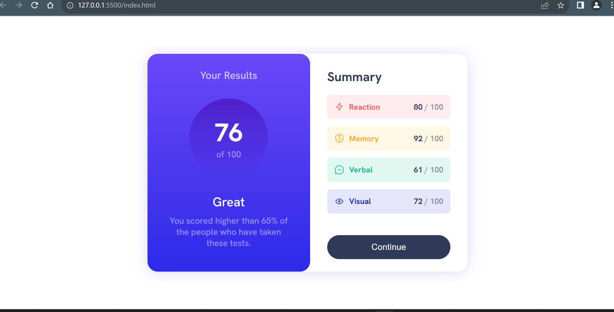
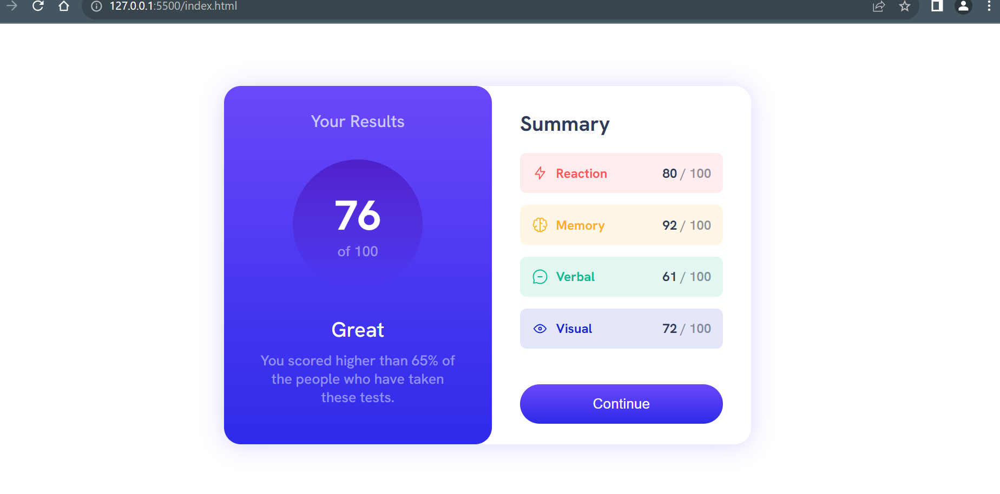

# Frontend Mentor - Results summary component solution

This is a solution to the [Results summary component challenge on Frontend Mentor](https://www.frontendmentor.io/challenges/results-summary-component-CE_K6s0maV). Frontend Mentor challenges help you improve your coding skills by building realistic projects.

## Table of contents

- [Overview](#overview)
  - [The challenge](#the-challenge)
  - [Screenshot](#screenshot)
  - [Links](#links)
  - [Built with](#built-with)
  - [What I learned](#what-i-learned)
  - [Continued development](#continued-development)
- [Author](#author)
- [Acknowledgments](#acknowledgments)

## Overview

This is the challenge of results-summary-component from FrontenMentor ,I have done and by the way nice challenge:D

### Screenshot

### Links

- Solution URL: [Add solution URL here](http://127.0.0.1:5500/index.html)
- Live Site URL: [Add live site URL here](https://your-live-site-url.com)

### Built with

- Semantic HTML5 markup
- CSS custom properties
- Flexbox

### What I learned

-I have learned some Javascript by doing this challenge and also CSS offcourse margins,paddings and mainly media-queries.

-And HTML also quite normal its a nice challenge for beginners who where trying to build some 3rd level components like this.

-Some CSS code snippet :

#this is for rounded circle around score:
.score::after {
content: " ";
display: block;
position: absolute;
top: 50%;
left: 50%;
border-radius: 50%;
transform: translate(-50%, -50%);
background: linear-gradient(
180deg,
hsla(256, 72%, 46%, 1),
hsla(241, 72%, 46%, 0)
);

    width: 10rem;
    height: 10rem;
    z-index: -1;

}

### Continued development

-Yes i'm really want to learn perfect from basic's to advance of HTML,CSS and Javascript,
-I'm shure with help of "FrontendMentor" i will learn all above mentioned in future projects.
-I want to focus on Javascript logics and HTML/CSS coding as well

## Author

- Website - [Add your name here](http://127.0.0.1:5500/index.html)
- Frontend Mentor - [@yourusername](https://www.frontendmentor.io/profile/SkAliya)

## Acknowledgments

#I have completed this challenge by Myself\*\*.
